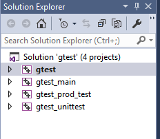
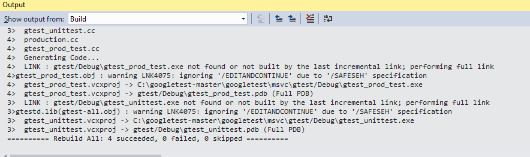
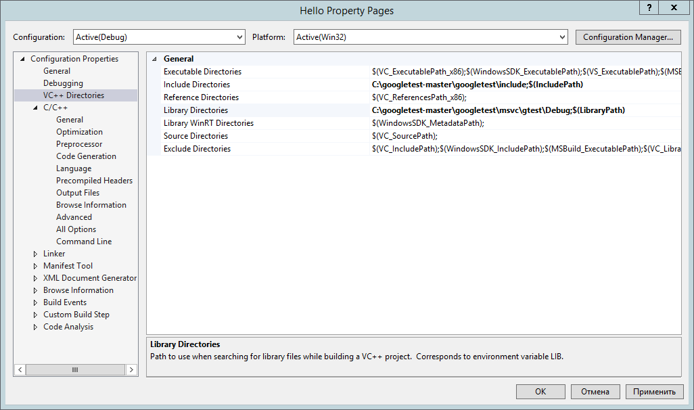
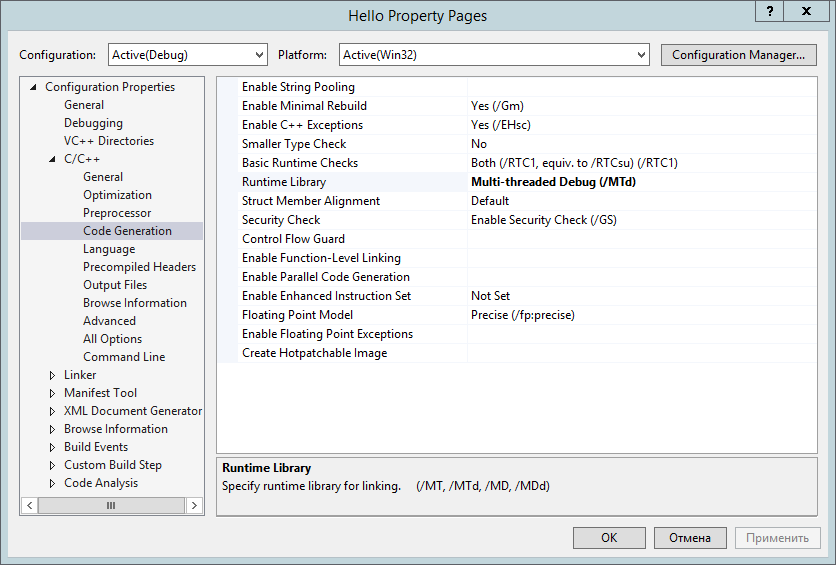
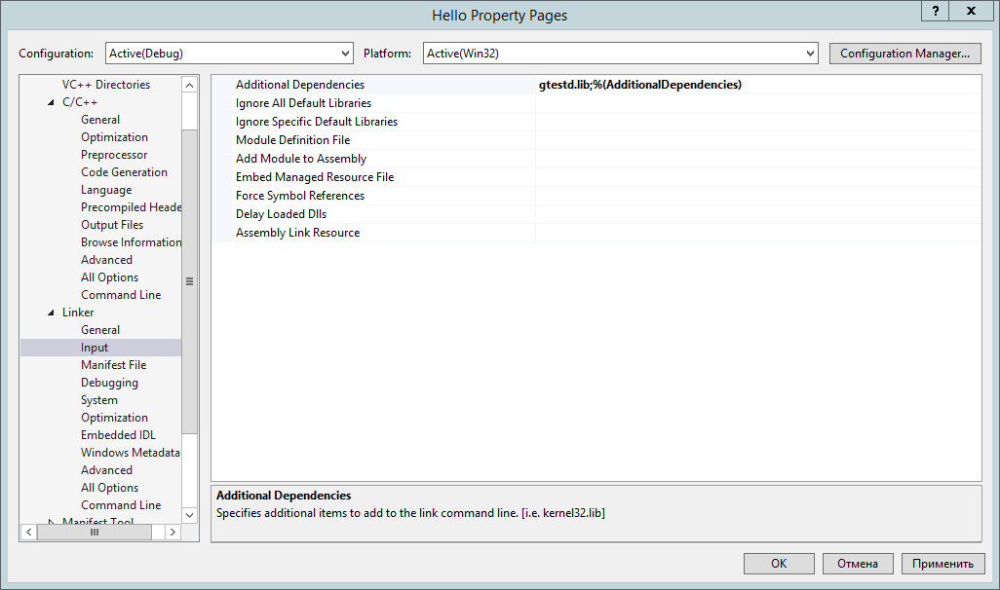
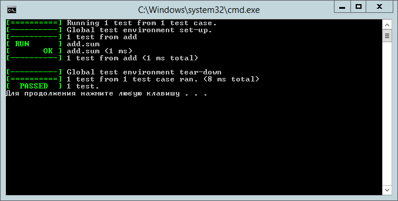

# Начало работы с Google Test

## Скачивание и усановка

Фреймворк **Google Test** используется в качестве средства для модульного тестирования программных проектов.

Скачать фреймворк можно по адресу: 
[https://github.com/google/googletest](https://github.com/google/googletest)

Можно скачивать файлы в виде ZIP-архива, а можно клонировать *Git*-репозитарий. После скачивания разворачиваем каталог в какое-нибудь удобное место на диске, например *C:\googletest-master*. 

Внутри имеется каталог *googletest*, который и содержит основное содержимое пакета.

Если предполагается работа с *Visual Studio*, то открываем проектное решение (**googletest\msvc\gtest.sln**) в VC и выполняем, если требуется, обновление формата проекта до более поздней версии.

Содержание окна проекта после открытия:

А это содержимое окна **Output** построения проекта:

В результате построения мы получили файл статической библиотеки, находящийся по адресу:

**C:\googletest-master\googletest\msvc\gtest\Debug\gtestd.lib**

## Создание пробного проекта с тестами

Для того чтобы воспользоваться *Google Test* создадим простой консольный проект **Win32** на языке **С++**.

Добавим в проект исходный файл **Source.cpp** со следующим содержимым:

     #include <stdio.h>
     #include <gtest/gtest.h>

     int add(int x, int y)
     {
	    return x + y;
     }

     TEST(add, sum)
     {
	    EXPECT_EQ(10,add(5,5));
     }

     int main(int argc, char **argv) 
     {
	      ::testing::InitGoogleTest(&argc, argv);
	      return RUN_ALL_TESTS();
     }

В приведенном примере мы написали один единственный тест для проверки корректности функции **add**, определенной здесь же.

Для того, чтобы проект мог быть успешно построен и запущен, необходимо сделать несколько настроек в проекте (**Project->Properties**)

Во-первых, требуется добавить пути к заголовочным и библиотечным файлам (на рисунке отмечены жирным шрифтом):  

Во-вторых, нужно сменить тип библиотеки времени выполнения (**Multi-threaded Debug**):

И, в-третьих, в настройках линкера нужно добавить имя библиотечного файла (**gtestd.lib**):

После построения и запуска программы мы увидим результаты прохождения нашего теста:

Теперь можно расширять программный код и набор тестов.